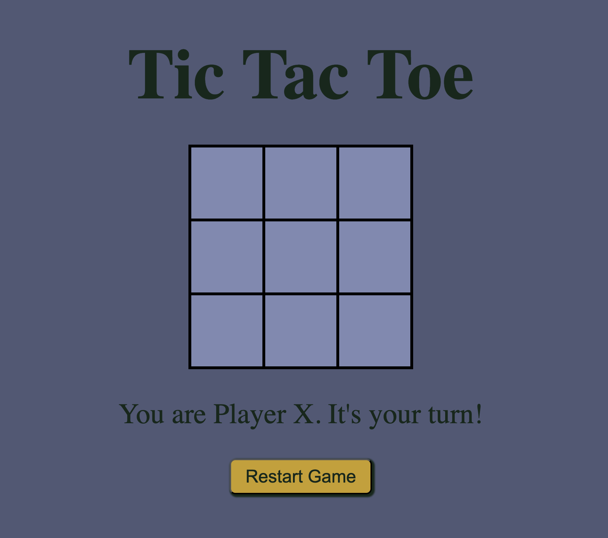

# Tic Tac Toe Multiplayer
A real-time multiplayer Tic Tac Toe game built using **HTML**, **CSS**, **JavaScript**, **Node.js**, and **Socket.IO**.



## Features
- **Real-time Multiplayer**: Play against another player over the same network.
- **Dynamic Gameplay**: Alternating turns with live updates.
- **Winning Detection**: Highlights the winning combination and displays the result.
- **Reset Functionality**: Alternates starting players after each reset.

## How to Play
1. Open the game in your browser.
2. Share your local IP with a friend to connect to the same game.
3. Take turns placing your symbol (X or O) on the grid.
4. The first player to align three symbols in a row, column, or diagonal wins!

## Setup
1. Clone the repository:
   ```bash
   git clone https://github.com/your-username/tic-tac-toe-multiplayer.git

2. Install Dependencies:
    ```bash
    npm install

3. start the server:
    ```bash
    npm start

4. Open the game in your browser:
    ```bash
    http://localhost:3000

5. Share your local IP with another player:
    ```bash
    http://<your-local-ip>:3000
    
